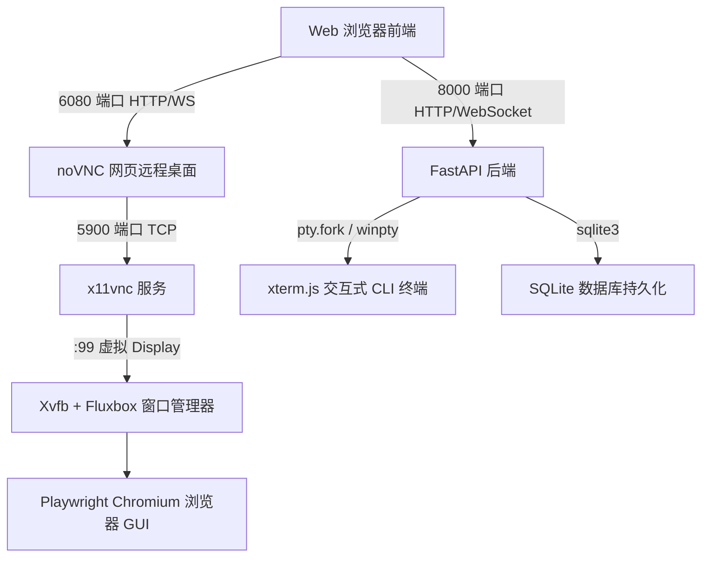

# 🚀 Docker 浏览器自动化、noVNC 远程桌面与网页 PTY 终端通用开发手册

本手册总结自真实的 Docker 容器化浏览器、noVNC 画中画远程桌面、xterm.js 交互式终端与全自动数据库迁移系统的开发经验。
**任何新项目需要该功能时，只需直接复制本手册的模板代码与避坑规则，即可实现零调试秒级开发落地！**

---

## 目录
1. [🛠️ 技术栈与全套组件架构](#1-技术栈与全套组件架构)
2. [📦 依赖环境清单 (Dockerfile 范式)](#2-依赖环境清单-dockerfile-范式)
3. [🚀 启动脚本范式 (entrypoint.sh)](#3-启动脚本范式-entrypointsh)
4. [🐍 Python / FastAPI 后端关键依赖 (requirements.txt)](#4-python--fastapi-后端关键依赖-requirementstxt)
5. [⚠️ 核心踩坑记录与避坑指南 (必看)](#5-核心踩坑记录与避坑指南-必看)
   - [坑点 1：Uvicorn WebSocket 404 / 拒绝升级连接](#坑点-1uvicorn-websocket-404--拒绝升级连接)
   - [坑点 2：Linux POSIX PTY 终端连接后黑屏无输出](#坑点-2linux-posix-pty-终端连接后黑屏无输出)
   - [坑点 3：Playwright 浏览器二进制包与 Python 库版本不匹配崩溃](#坑点-3playwright-浏览器二进制包与-python-库版本不匹配崩溃)
   - [坑点 4：新电脑/全新 Docker 挂载空目录引发全量 API 500 报错](#坑点-4新电脑全新-docker-挂载空目录引发全量-api-500-报错)
   - [坑点 5：Dockerfile 构建过程中网络下载第三方 CLI 频繁中断](#坑点-5dockerfile-构建过程中网络下载第三方-cli-频繁中断)
   - [坑点 6：终端长 URL 换行撕裂引发 Google OAuth 400 Bad Request](#坑点-6终端长-url-换行撕裂引发-google-oauth-400-bad-request)
   - [坑点 7：伪终端回车符丢失与授权 Code 回传输入困难](#坑点-7伪终端回车符丢失与授权-code-回传输入困难)
6. [📋 新项目 5 分钟极速迁移 Checklist](#6-新项目-5-分钟极速迁移-checklist)

---

## 1. 🛠️ 技术栈与全套组件架构

系统采用无头/有头兼容的双模式架构：



* **Web 看板与 API 引擎**：FastAPI + Uvicorn (ASGI)
* **无头/有头浏览器自动化**：Playwright Python (Chromium)
* **虚拟显示屏与图形化环境**：Xvfb (1280x800x24) + Fluxbox 窗口管理器
* **网页画中画远程桌面**：x11vnc (5900 端口) + websockify + noVNC (6080 端口)
* **网页交互式伪终端 (PTY)**：xterm.js + PyWinpty (Windows) / `pty.fork()` (Linux) + WebSockets
* **数据持久化**：SQLite3 + 自动建表与 Migration 热升级兜底机制

---

## 2. 📦 依赖环境清单 (Dockerfile 范式)

新建项目时直接复制以下 Dockerfile 范本：

```dockerfile
# 1. 必须强锁定 Playwright 基础镜像版本
FROM mcr.microsoft.com/playwright/python:v1.61.0-jammy

WORKDIR /app

# 设置静默安装与时区，避免 apt 交互卡死
ENV DEBIAN_FRONTEND=noninteractive
ENV TZ=Asia/Shanghai
ENV DISPLAY=:99
ENV PYTHONUNBUFFERED=1

# 安装系统依赖：Xvfb, x11vnc, novnc, websockify, fluxbox, Node.js 等
RUN apt-get update && DEBIAN_FRONTEND=noninteractive apt-get install -y --no-install-recommends \
    xvfb \
    x11vnc \
    novnc \
    websockify \
    fluxbox \
    curl gnupg tzdata \
    && curl -fsSL https://deb.nodesource.com/setup_18.x | bash - \
    && DEBIAN_FRONTEND=noninteractive apt-get install -y nodejs \
    && apt-get clean && rm -rf /var/lib/apt/lists/*

# 复制依赖并安装
COPY requirements.txt .
RUN pip install --no-cache-dir -r requirements.txt

# 安装第三方 npm/cli 依赖 (增加重试机制)
RUN (for i in 1 2 3 4 5; do curl -fsSL https://antigravity.google/cli/install.sh | bash && break || sleep 3; done) \
    && echo 'export PATH="$HOME/.local/bin:$PATH"' >> /etc/environment
ENV PATH="/root/.local/bin:${PATH}"

COPY . .
RUN chmod +x /app/entrypoint.sh

# 8000: Web API / 6080: noVNC 画中画远程桌面
EXPOSE 8000 6080

CMD ["/bin/bash", "/app/entrypoint.sh"]
```

---

## 3. 🚀 启动脚本范式 (entrypoint.sh)

在项目根目录下新建 `entrypoint.sh`：

```bash
#!/bin/bash
set -e

# 1. 清理旧锁文件
rm -f /tmp/.X99-lock /tmp/.X11-unix/X99 2>/dev/null || true

# 2. 启动 Xvfb 虚拟屏幕 (1280x800, 24位色)
Xvfb :99 -screen 0 1280x800x24 > /dev/null 2>&1 &
sleep 1

# 3. 启动轻量级窗口管理器
fluxbox > /dev/null 2>&1 &

# 4. 启动 x11vnc 服务 (5900 端口)
x11vnc -display :99 -forever -shared -rfbport 5900 -nopw -bg > /dev/null 2>&1

# 5. 启动 websockify + noVNC 网页服务 (6080 端口)
websockify --web=/usr/share/novnc/ 6080 localhost:5900 > /dev/null 2>&1 &

# 6. 启动 FastAPI 后端服务器 (8000 端口)
exec uvicorn web.backend.app:app --host 0.0.0.0 --port 8000
```

---

## 4. 🐍 Python / FastAPI 后端关键依赖 (requirements.txt)

```text
fastapi>=0.100.0
uvicorn[standard]>=0.20.0
websockets>=11.0
pydantic>=2.0.0
playwright==1.61.0
requests>=2.31.0
pyyaml>=6.0
```

> ⚠️ **关键点**：`uvicorn[standard]` 与 `websockets` **必须同时存在**，否则 FastAPI 的 WebSocket 接口会直接拒绝升级请求并返回 404！`playwright` 版本必须与 Dockerfile 基础镜像中指定的版本 (`v1.61.0`) 100% 绝对一致。

---

## 5. ⚠️ 核心踩坑记录与避坑指南 (必看)

### 坑点 1：Uvicorn WebSocket 404 / 拒绝升级连接
* **现象**：前端建立 `ws://localhost:8000/api/...` 连接时，服务端日志提示：
  `WARNING: No supported WebSocket library detected.`
  `INFO: 172.17.0.1 - "GET /api/... HTTP/1.1" 404 Not Found`
* **根源**：Uvicorn 默认不包含 WebSocket 协议解析器，缺少 `websockets` 或 `wsproto` 依赖包。
* **解决方案**：`requirements.txt` 中必须同时声明 `uvicorn[standard]` 和 `websockets>=11.0`。

---

### 坑点 2：Linux POSIX PTY 终端连接后黑屏无输出
* **现象**：网页端的 xterm.js 伪终端显示 `[System] 正在连接 PTY 伪终端...`，WebSocket 连接状态为 `accepted`，但黑框内部一片漆黑，打字无响应。
* **根源**：Go 语言构建的 Bubbletea/TUI 应用启动时会读取 PTY 的**窗口行列尺寸 (`TIOCSWINSZ`)**。如果 Python 在 `pty.fork()` 创建 POSIX 伪终端后没有显式给 PTY Slave 初始化行列尺寸（高宽默认 0x0），TUI 会陷入静默挂起等待状态。
* **解决方案**：在 Linux 的 `pty.fork()` 子进程代码块中，必须显式调用 `termios` 注入初始化窗口尺寸与色彩环境变量：

```python
import pty, os, fcntl, termios, struct

pid, fd = pty.fork()
if pid == 0:  # child
    # 强制初始化 24 行 80 列控制台尺寸
    winsize = struct.pack("HHHH", 24, 80, 0, 0)
    fcntl.ioctl(0, termios.TIOCSWINSZ, winsize)
    fcntl.ioctl(1, termios.TIOCSWINSZ, winsize)
    os.environ["TERM"] = "xterm-256color"
    os.environ["COLORTERM"] = "truecolor"
    os.execve(cmd_args[0], cmd_args, env)
```

---

### 坑点 3：Playwright 浏览器二进制包与 Python 库版本不匹配崩溃
* **现象**：Docker 中运行 Playwright 抛出异常：
  `Executable doesn't exist at /ms-playwright/chromium_headless_shell-...`
* **根源**：`Dockerfile` 使用的基础镜像版本（如 `v1.40.0`）与 `requirements.txt` 中未锁定的最新版本（如 `1.61.0`）不一致，导致 Python 代码寻找的二进制文件名与 Docker 镜像内部内置的文件名不契合。
* **解决方案**：`Dockerfile` 的基础镜像 tag 与 `requirements.txt` 中的包必须**锁定同一个版本**：
  `FROM mcr.microsoft.com/playwright/python:v1.61.0-jammy`
  `playwright==1.61.0`

---

### 坑点 4：新电脑/全新 Docker 挂载空目录引发全量 API 500 报错
* **现象**：在新机器上使用 `-v "${PWD}/data:/app/data"` 部署后，前端所有需要读取数据库的 API 全部返回 `500 Internal Server Error`，日志提示 `sqlite3.OperationalError: no such table`。
* **根源**：宿主机的新挂载目录是一个空文件夹，后端启动时没有自动检查并建表/升表，直接进行 SQL 联查抛错。
* **解决方案**：在 FastAPI 后端 `app.py` 的初始化入口加入全自动保底建表与 Migration 升级函数：

```python
def ensure_database_initialized():
    """保证在任何全新部署或空挂载目录下，数据库与所有 Schema 均 100% 自动初始化完成"""
    try:
        from database import init_db
        init_db()  # 1. 创建基础表结构
    except Exception as e:
        print(f"[DB AutoInit] init_db failed: {e}")

    try:
        from biji_migrator import migrate_database
        db_path = os.path.join(ROOT_DIR, "data", "distiller.db")
        migrate_database(db_path)  # 2. 自动补充多账号与扩展列
    except Exception as e:
        print(f"[DB AutoInit] migrate_database failed: {e}")

    try:
        upgrade_db_schema()  # 3. 热升级防缺列补丁
    except Exception as e:
        print(f"[DB AutoInit] upgrade_db_schema failed: {e}")

ensure_database_initialized()
```

并在 `GET /api/...` 遇到 `sqlite3.OperationalError` 时捕获自动触发一次 `migrate_database()` 实时修复，无缝兼容新旧数据库。

---

### 坑点 5：Dockerfile 构建过程中网络下载第三方 CLI 频繁中断
* **现象**：`docker build` 运行到 `curl -fsSL https://... | bash` 时抛出 `OpenSSL SSL_read: unexpected eof` 终止构建。
* **根源**：国内或跨境网络波动导致 `curl` 单次传输失败。
* **解决方案**：在 `Dockerfile` 中使用 bash 的 `for` 循环增加 5 次重试保护：

```dockerfile
RUN (for i in 1 2 3 4 5; do curl -fsSL https://antigravity.google/cli/install.sh | bash && break || sleep 3; done) \
    && echo 'export PATH="$HOME/.local/bin:$PATH"' >> /etc/environment
```

---

### 坑点 6：终端长 URL 换行撕裂引发 Google OAuth 400 Bad Request
* **现象**：xterm.js 终端打印出超长 OAuth 网址后，用户在控制台中框选复制粘贴到浏览器打开时，Google 返回 `400. 出现了错误。服务器无法处理该请求，因为其格式不正确。`
* **根源**：80 列宽度的终端在渲染长网址时将其切割成多行。鼠标框选复制时，复制出的字符串中混入了隐式的**换行符 (`\r\n`) 或空格**，导致传递给 Google 的 URL 凭据损坏。
* **解决方案**：在前端 `ws.onmessage` 中拦截文本流，使用多行截取算法自动擦除 URL 段落中的所有 `\r`, `\n`, `\t`, 空格，拼装出 100% 无损的 URL，并在终端正上方实时渲染出一个可直接点击跳转的超链接 Banner：

```javascript
function extractCleanAuthUrl(streamText, provider) {
    if (!streamText) return null;
    let text = streamText.replace(/[\u001b\u009b][\[()#;?]*(?:[0-9]{1,4}(?:;[0-9]{0,4})*)?[0-9A-ORZcf-nqry=><]/g, '');
    let startIdx = text.indexOf("https://accounts.google.com/o/oauth2/auth?");
    if (startIdx === -1) return null;
    let sub = text.substring(startIdx);
    const endKeywords = ["If you aren't", "authorization code", "If not:"];
    let endIdx = sub.length;
    for (let kw of endKeywords) {
        let pos = sub.indexOf(kw);
        if (pos !== -1 && pos < endIdx) endIdx = pos;
    }
    sub = sub.substring(0, endIdx);
    // 抹平段落内所有换行与空格
    let cleanUrl = sub.replace(/[\r\n\t\s"'>]+/g, '');
    if (cleanUrl.includes("state=") || cleanUrl.length > 280) return cleanUrl;
    return null;
}
```

---

### 坑点 7：伪终端回车符丢失与授权 Code 回传输入困难
* **现象**：用户在第三方 OAuth 页面登录成功拿到 Code 字符串后，粘贴到 xterm.js 框里终端没反应；或者不知道如何提交 Code。
* **根源**：常规网页粘贴事件没有自动向底层 PTY 写入回车符 (`\r`)，CLI 进程停留在输入缓冲区等待回车。
* **解决方案**：
  1. 在终端正下方提供专属的 `[ 粘贴 Code 输入框 ]` + `[ 发送 Code 到终端 ↵ ]` 按钮，点击时自动拼接 `code + "\r"` 发给 WebSocket。
  2. 监听终端 `container.addEventListener("paste")` 事件，捕获到粘贴内容时自动追加 `\r` 提交。

---

## 6. 📋 新项目 5 分钟极速迁移 Checklist

当您需要为**新项目**开启 Docker 浏览器 + 远程桌面 + 网页终端时，只需按照以下步骤操作：

- [ ] **Step 1**: 复制 `Dockerfile` 范本，确保 `FROM mcr.microsoft.com/playwright/python:v1.61.0-jammy`。
- [ ] **Step 2**: 复制 `entrypoint.sh`，确保依次启动 `Xvfb :99` -> `fluxbox` -> `x11vnc` -> `websockify` -> `uvicorn`。
- [ ] **Step 3**: 复制 `requirements.txt`，确保包含 `fastapi`, `uvicorn[standard]`, `websockets`, `playwright==1.61.0`。
- [ ] **Step 4**: 启动 Docker 命令映射端口 `-p 8899:8000 -p 6080:6080 -e DISPLAY=:99`。
- [ ] **Step 5**: 在后端引入 `ensure_database_initialized()`，确保全新挂载目录下自动建表。
- [ ] **Step 6**: 在 PTY 伪终端启动代码中，为 Linux 进程注入 `termios.TIOCSWINSZ` 的 `24x80` 初始窗口尺寸。
- [ ] **Step 7**: 前端引入 `xterm.js`，并在 `ws.onmessage` 中绑定 URL 擦除提取与 Code 发送输入框。

**🎉 按照此手册规范，新项目可 100% 规避所有构建、环境、网络与交互坑点，一次性开发成功！**
