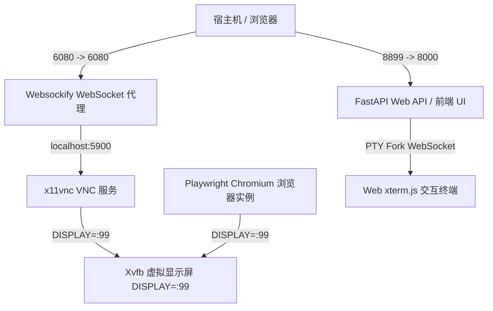
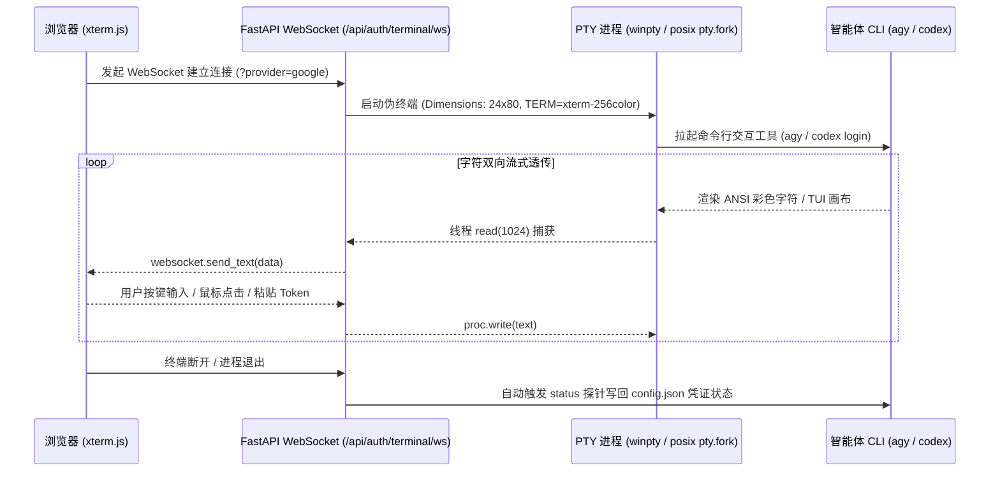

# Docker + Playwright + noVNC 远程桌面与 Web PTY 终端通用架构开发指南 (迁移复用手册)

> 📌 **文档说明**：本文档总结了在 Docker 环境下搭建 **Playwright 无头/有头浏览器**、**noVNC 网页远程桌面 (画中画)**、**Web PTY 伪终端** 及 **SQLite 数据层全自动热初始化** 的全套技术闭环与采坑避坑经验。后续任何新项目需要类似功能，只需直接复制本工程的 `Dockerfile`、`entrypoint.sh`、`docker-compose.yml` 及相关模块代码即可快速落地。

---

## 🛠️ 1. 核心技术栈与固定版本依赖 (环境对齐)

为了彻底杜绝“在本地好用、进 Docker 就崩溃”的问题，所有基础镜像与浏览器版本必须进行**强版本锁定**：

### 镜像与浏览器版本
- **Docker 基础镜像**：`mcr.microsoft.com/playwright/python:v1.61.0-jammy`
- **Playwright Python SDK**：`playwright==1.61.0`（**必须与基础镜像版本完全一致！**）
- **Node.js 运行时**：`Node.js 18.x`（Nodesource `18.20.8`）
- **Ubuntu 系统版本**：`Ubuntu 22.04 LTS (Jammy Jellyfish)`
- **内置浏览器版本**：Chromium 1.61.0 (`/ms-playwright/chromium-1228`)

### Python 关键依赖库 (`requirements.txt`)
```text
fastapi>=0.100.0
uvicorn[standard]>=0.20.0
websockets>=11.0
pydantic>=2.0.0
playwright==1.61.0
requests>=2.31.0
pyyaml>=6.0
```

### APT 系统依赖与环境变量 (Dockerfile 必备)
```dockerfile
ENV DEBIAN_FRONTEND=noninteractive
ENV TZ=Asia/Shanghai

RUN apt-get update && DEBIAN_FRONTEND=noninteractive apt-get install -y --no-install-recommends \
    xvfb \
    x11vnc \
    novnc \
    websockify \
    fluxbox \
    curl gnupg tzdata \
    && curl -fsSL https://deb.nodesource.com/setup_18.x | bash - \
    && DEBIAN_FRONTEND=noninteractive apt-get install -y nodejs \
    && apt-get clean && rm -rf /var/lib/apt/lists/*
```

---

## 🏗️ 2. Docker 架构与启动组件设计

### 2.1 启动服务链路与端口划分



### 2.2 启动脚本 (`entrypoint.sh`) 最佳实践

```bash
#!/bin/bash
set -e

# 1. 启动 Xvfb 虚拟屏幕 (DISPLAY=:99)
Xvfb :99 -screen 0 1280x1024x24 &
export DISPLAY=:99
sleep 1

# 2. 启动轻量级窗口管理器 fluxbox (防止浏览器无窗口框架)
fluxbox &
sleep 1

# 3. 启动 x11vnc 监听 5900 端口
x11vnc -display :99 -forever -shared -rfbport 5900 -nopw &
sleep 1

# 4. 启动 websockify 桥接 6080 (Web) 与 5900 (VNC)
websockify --web /usr/share/novnc/ 6080 localhost:5900 &
sleep 1

# 5. 启动 Python 后端服务
exec python3 web/backend/app.py
```

### 2.3 `docker-compose.yml` 极简配置模板

```yaml
version: '3.8'

services:
  app:
    build: .
    container_name: my-app-container
    ports:
      - "8899:8000"  # Web API & 看板主端口
      - "6080:6080"  # noVNC 远程桌面画中画端口
    environment:
      - HOST=0.0.0.0
      - PORT=8000
      - DISPLAY=:99
      - PYTHONUNBUFFERED=1
    volumes:
      - ./data:/app/data        # 数据库与 Cookie 沙箱持久化目录
      - ./output:/app/output      # 文件产出目录
    restart: always
```

### 2.4 Web PTY 伪终端与 CLI 客户端跨平台双向架构

为了在 Docker 容器及 Windows 宿主机上无缝运行 Google `agy` 及 OpenAI `codex` 等基于 Go / Bubbletea 的 Rich TUI 命令行交互工具，必须通过 **xterm.js + PTY (伪终端) + WebSocket** 进行双向全双工字符流通信。

#### 1. 架构流向图


#### 2. 后端 PTY 跨平台适配核心实现代码 (`app.py`)
```python
@app.websocket("/api/auth/terminal/ws")
async def terminal_ws_endpoint(websocket: WebSocket, provider: str):
    await websocket.accept()
    settings = load_settings()
    provider = provider.lower()
    
    # 1. 动态确定可执行文件路径
    cmd_args = [shutil.which("agy") or "agy"] if provider == "google" else ["codex", "login", "--device-auth"]
    
    # 2. 设置终端环境变量 (必须声明 TERM 与 COLORTERM)
    env = os.environ.copy()
    env["BROWSER"] = "false"
    env.pop("DISPLAY", None)
    
    is_windows = os.name == "nt"
    if is_windows:
        # Windows: 使用 winpty.PtyProcess 产生 ConPTY 会话
        from winpty import PtyProcess
        cmd_line = subprocess.list2cmdline(cmd_args)
        proc = PtyProcess.spawn(cmd_line, env=env, cwd=ROOT_DIR, dimensions=(24, 80))
    else:
        # Linux / Docker: 使用 POSIX pty.fork() 产生原生 PTY 会话
        import pty, fcntl, termios, struct
        pid, fd = pty.fork()
        if pid == 0:  # Child process
            winsize = struct.pack("HHHH", 24, 80, 0, 0)
            fcntl.ioctl(0, termios.TIOCSWINSZ, winsize)
            fcntl.ioctl(1, termios.TIOCSWINSZ, winsize)
            os.environ["TERM"] = "xterm-256color"
            os.environ["COLORTERM"] = "truecolor"
            os.execve(cmd_args[0], cmd_args, env)
        else:
            # Parent process logic
            pass
```

### 2.5 Docker 容器下 AI 智能体 CLI (`agy` / `codex`) 后台静默流式日志规范

在 Docker/Linux 无头容器环境下拉起 Google `agy` 或 OpenAI `codex` 智能体时，为保障其多层推导与工具链日志能在 Web 控制台中 100% 实时流式输出，必须遵守以下执行规范：

1. **显式注入 `--verbose` 详细日志开关**：
   - 在 Docker 下静默运行 `agy` 时，若未携带 `--verbose` 参数，`agy` 的思考推导、文件读取与 API 交互过程会被静默隐藏。
   - **正确指令模板**：`agy --verbose --dangerously-skip-permissions --add-dir /app --model <model_name> -p <prompt>`
2. **启用 `PYTHONUNBUFFERED=1` 与按行刷新**：
   - 后端 Popen 子进程读取 `stdout` 时必须配置 `PYTHONUNBUFFERED=1`，并在逐行读取 `f.write(line)` 后显式调用 `f.flush()`，防止 Linux 管道缓冲区等待 EOF 阻塞。
3. **`shutil.which` 路径感知**：
   - Linux 容器下的 `agy` 可能安装于 `/usr/local/bin/agy` 或 `/root/.local/bin/agy`。拉起进程前必须优先使用 `shutil.which("agy")` 解析全路径，防止全局 PATH 路径丢失。

---

## 💣 3. 踩坑记录与核心踩坑经验 (Bug 防退化)

### 坑 1: Playwright 与 Docker 基础镜像版本漂移崩溃
- **现象**：在 Docker 内启动 Playwright 报错：`BrowserType.launch_persistent_context: Executable doesn't exist at /ms-playwright/chromium_headless_shell-1228/...`
- **根源**：`requirements.txt` 中写了 `playwright>=1.40.0`，导致 Docker 构建时拉取了 `1.61.0` 的 Python SDK，但基础镜像使用的是旧版，内置的浏览器路径不匹配。
- **解法**：基础镜像必须为 `v1.61.0-jammy`，且 `requirements.txt` 中**严格写死 `playwright==1.61.0`**。

### 坑 2: WebSocket 升级请求返回 404 / 500
- **现象**：前端建立 WebSocket 连接时，Uvicorn 抛出：`WARNING: No supported WebSocket library detected.`，网页连接断开。
- **根源**：Uvicorn 默认安装包不包含 WebSocket 解析器。
- **解法**：`requirements.txt` 必须包含 `uvicorn[standard]` 与 `websockets>=11.0`。

### 坑 3: Linux PTY (pty.fork) 中 Bubbletea / TUI 界面黑屏挂死
- **现象**：Web PTY 伪终端打开后，运行 `agy` 或 `codex` 等 Go 语言 TUI 交互工具时黑屏，无字符输出。
- **根源**：`pty.fork()` 子进程的伪终端默认窗口尺寸为 `0x0`，导致 TUI 库等待窗口尺寸信号陷入死锁。
- **解法**：在 `pty.fork()` 的 child 分支中，必须显式注入窗口尺寸与环境变量：
  ```python
  import fcntl, termios, struct
  winsize = struct.pack("HHHH", 24, 80, 0, 0)
  fcntl.ioctl(0, termios.TIOCSWINSZ, winsize)
  fcntl.ioctl(1, termios.TIOCSWINSZ, winsize)
  os.environ["TERM"] = "xterm-256color"
  os.environ["COLORTERM"] = "truecolor"
  ```

### 坑 4: PTY 终端长 OAuth URL 在 80 列切分后导致 Google 返回 400
- **现象**：点击终端打印的 OAuth 链接，Google 提示 `400. 出现了错误。服务器无法处理该请求，因为其格式不正确`。
- **根源**：终端列宽限制为 80 列，超长 URL 被换行符（`\n`）撕裂为多行。手动复制或简单正则提取会保留内部换行符或漏掉后半截 `state=` 参数。
- **解法**：流式拼接原始文本，彻底清理 `[\r\n\t\s"'>]+` 换行与空格，并在校验包含 `state=` 关键参数后再渲染成超链接跳转按钮。

### 坑 5: 全新机器 / 空 Volume 挂载下 API 报 500 sqlite3.OperationalError
- **现象**：在新电脑启动 Docker（`-v "${PWD}/data:/app/data"` 挂载全新空目录），前端数据表格提示 `数据加载失败`（500 错误）。
- **根源**：挂载的物理 `./data` 目录为空，`distiller.db` 不存在。若应用启动时未自动运行建表与 Migration 函数，API 查询 `SELECT * FROM bloggers` 会直接因缺少数据表而抛出 500。
- **解法**：在后端 `app.py` 入口点封装 `ensure_database_initialized()`，应用一启动即自动按顺序执行 `init_db()`、`migrate_database()` 和 `upgrade_db_schema()`，保证任何新机器部署均 100% 自动构建物理库与最新字段。

### 坑 6: Docker 下运行 agy 任务时控制台只有启动日志、缺乏思考推导过程
- **现象**：在 Docker 控制台中点击启动博主蒸馏/单视频拆解时，日志打印完命令后就没有下文了，前端无法看到智能体的思索过程。
- **根源**：`agy` 默认静默捕获输出，在非 TTY 容器环境中未带 `--verbose` 参数，且 Popen 的 stdout 未及时 `flush()` 清除缓冲区。
- **解法**：后端拉起 `agy` 时固定传入 `--verbose` 参数，配合 `shutil.which("agy")` 全路径，并在写日志循环中显式调用 `f.flush()`。

---

## 📋 4. 通用迁移清单 (New Project Checklist)

新项目引入 Docker 远程桌面与 Web 终端时，请按以下步骤快速部署：

- [ ] 复制 `Dockerfile`、`entrypoint.sh`、`docker-compose.yml` 到项目根目录。
- [ ] 确认 `requirements.txt` 中包含 `uvicorn[standard]`、`websockets>=11.0` 与 `playwright==1.61.0`。
- [ ] 挂载目录包含数据持久化目录 `data/`（用于保存 SQLite `distiller.db` 以及 Playwright persistent context `browser_context/`）。
- [ ] 后端启动时引入自动建表与 Migration 函数，避免新部署环境抛出 500。
- [ ] 运行容器时映射 `-p 8899:8000` (API) 与 `-p 6080:6080` (noVNC)，并指定 `-e DISPLAY=:99` 与 `--restart always`。
